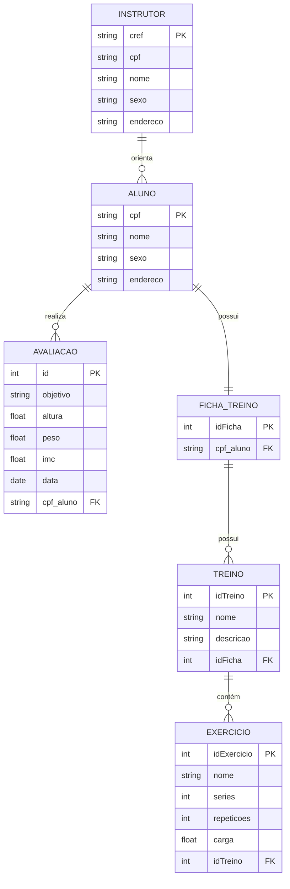

# 🏋️ MyAcademy - Sistema de Gestão de Treinos

O **MyAcademy** é um sistema desenvolvido para auxiliar academias no **gerenciamento de treinos e avaliações de alunos**, oferecendo maior controle e organização tanto para os instrutores quanto para a administração.

---

## 📌 Contexto

Instrutores de uma academia **X** enfrentavam dificuldades em controlar os treinos de seus alunos.  
O processo era feito de forma manual, o que resultava em falta de organização e dificuldade na análise de dados.  

Apesar de algumas informações já estarem armazenadas em sistema (como dados de alunos e instrutores), **a ficha de treinos ainda era gerida manualmente**, dificultando:

- O acompanhamento de quantas vezes um aluno renovou sua ficha;
- O controle de quais exercícios cada aluno estava realizando;
- O monitoramento do uso de máquinas e equipamentos;
- A tomada de decisões estratégicas sobre substituição ou aquisição de equipamentos;
- O planejamento de ações de marketing mais eficazes.

---

## 🎯 Objetivo do Sistema

O sistema foi desenvolvido para:

- Centralizar e digitalizar o controle de **treinos e avaliações** dos alunos;
- Permitir que instrutores realizem **consultas rápidas**, como:
  - Quantos alunos estão sob sua responsabilidade;
  - Quantas vezes cada aluno realizou avaliações;
  - Visualização do treino atual de um aluno.

---

## 🗂️ Estrutura de Dados

### 📌 Aluno
- `cpf`
- `nome`
- `sexo`
- `endereço`

### 📌 Instrutor
- `cref`
- `cpf`
- `nome`
- `sexo`
- `endereço`

### 📌 Avaliação
- Ligada diretamente a um **Aluno** (via `cpf`);
- Armazena as avaliações realizadas para acompanhamento de evolução.

### 📌 Ficha de Treino
- Ligada diretamente a um **Aluno**;
- Contém os treinos programados.

### 📌 Treino
- `idTreino`
- `nome` (ex: Treino A, Pernas, Peito e Tríceps)
- `descrição`

### 📌 Exercício
- `idExercicio`
- `nome` (ex: Supino reto, Agachamento, Rosca bíceps)
- `séries`
- `repetições`
- `carga`

---

## 📊 Modelo Entidade-Relacionamento (DER)

O modelo abaixo representa a estrutura do sistema **MyAcademy**:

## 📄 Licença
Este projeto é de uso acadêmico/educacional.  